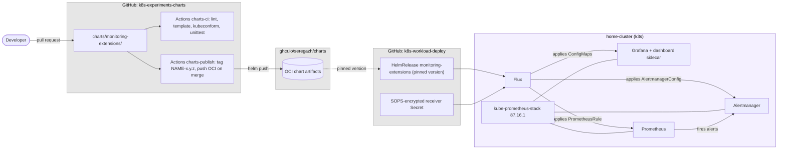
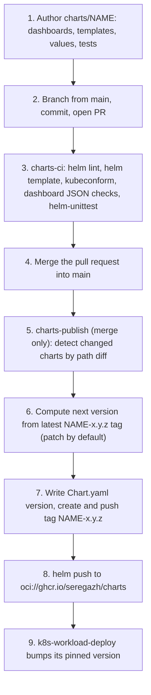

# k8s-experiments-charts — Specification

Status: **Draft v0.1** · Scope: **`home-cluster` monitoring extensions only**

This document is the source-of-truth specification for the `k8s-experiments-charts` repository.
We follow **spec-driven development**: the specification is authored and agreed **before** the chart
code is written. Implementation tasks trace back to sections of this document; design changes are
made here first, then in code.

It describes how **custom Grafana dashboards** and **Alertmanager configuration** are packaged as a
Helm chart and layered on top of the upstream `kube-prometheus-stack` release that already runs on
`home-cluster`, without forking or wrapping that chart.

---

# 1. Goals

- Deliver **custom Grafana dashboards** and **Alertmanager routing/receivers** as versioned,
  reviewable artifacts instead of hand-clicked UI state.
- **Never fork, vendor, or wrap `kube-prometheus-stack`.** Upstream stays a plain upstream release
  that can be bumped on its own schedule.
- Keep the extension **additive and removable**: deleting the release must leave the upstream stack
  fully functional.
- Keep **every secret out of the repository** — receiver credentials are referenced by name, never
  carried as values.
- Publish charts as **versioned OCI artifacts** so the consuming GitOps repo pins an immutable
  version, exactly as it already pins `kube-prometheus-stack: 87.16.1`.
- Stay **cluster-portable**: `home-cluster` today, `gpu-dev` and `dev` later, with values as the only
  difference.

---

# 2. Overview

`k8s-experiments-charts` is a **monorepo of Helm charts**. It contains no cluster configuration and
no Flux resources — it *publishes* charts; the sibling repo `k8s-workload-deploy` *consumes* them.

The first chart, **`monitoring-extensions`**, ships three kinds of Kubernetes object and nothing
else:

| Object | Consumed by | Purpose |
|---|---|---|
| `ConfigMap` labelled `grafana_dashboard: "1"` | Grafana dashboard sidecar | custom dashboards |
| `AlertmanagerConfig` | Prometheus Operator | routes + receivers |
| `PrometheusRule` | Prometheus Operator | the alert rules that feed those routes |

All three are **custom resources or sidecar inputs of a release that already exists**. That is what
makes this an extension rather than a wrapper: the chart owns no Deployment, no Service, no PVC, and
no workload of any kind.

## 2.1 Solution overview



## 2.2 Repository structure

One folder → one chart → one published OCI artifact.

```
k8s-experiments-charts/
├── README.md
├── LICENSE
├── spec/
│   └── specification.md            # this document
├── charts/
│   └── monitoring-extensions/
│       ├── Chart.yaml              # no dependencies — see §6
│       ├── values.yaml
│       ├── README.md               # generated values table
│       ├── dashboards/             # raw .json, one file per dashboard
│       │   └── *.json
│       ├── templates/
│       │   ├── dashboards-configmap.yaml
│       │   ├── alertmanagerconfig.yaml
│       │   ├── prometheusrule.yaml
│       │   └── _helpers.tpl
│       └── tests/                  # helm-unittest suites
│           └── *_test.yaml
└── .github/
    └── workflows/
        ├── charts-ci.yml           # pull request: build + test only
        └── charts-publish.yml      # merge to main: tag + push OCI
```

## 2.3 Naming and versioning

Mirrors the module convention already used in `infrastructure-experiments`, so both repos version
shared building blocks the same way:

- Every chart is versioned **independently**; a change to one chart never bumps another.
- The version lives in a **Git tag** `<chart>-<major>.<minor>.<patch>` — e.g.
  `monitoring-extensions-0.1.0`. The tag is the single source of truth, and `Chart.yaml`'s `version`
  is written from it by CI rather than edited by hand.
- **Only on merge to `main`** does CI diff `charts/<name>/`, bump **only** the changed charts
  (**patch** by default, **minor** on `#minor` in the merge message, **major** on `#major`), tag, and
  push.
- Charts are pushed as OCI artifacts to **`ghcr.io/seregazh/charts`** — the same registry that
  already hosts the `k8s-experiments` service images.
- `appVersion` is meaningless here (the chart ships no image) and is left at `"0"`.

## 2.4 Responsibility split

The single most important boundary in this design. Getting it wrong is how secrets end up in git.

| Concern | Lives in | Why |
|---|---|---|
| Dashboard JSON | **chart** | portable across clusters, reviewed as code |
| Alert rule expressions and thresholds | **chart** | ditto; thresholds overridable by values |
| Route tree shape (grouping, inhibition, timings) | **chart** | structure, not environment |
| Receiver **type** and target (Slack channel, email address) | **chart values** | per-cluster, non-secret |
| Receiver **credential** (webhook URL, SMTP password) | **`k8s-workload-deploy`, SOPS-encrypted** | secret |
| Which chart version a cluster runs | **`k8s-workload-deploy`** | pinned per cluster |
| `kube-prometheus-stack` values | **`k8s-workload-deploy`** | upstream release stays upstream |

The chart references credentials **by Secret name and key only**. It must never accept a credential
as a Helm value, because Helm values in a `HelmRelease` are plaintext in git.

---

# 3. Extension mechanisms

Each mechanism below was verified against `kube-prometheus-stack` **87.16.1** as currently deployed.

## 3.1 Grafana dashboards — the sidecar contract

The Grafana subchart runs a sidecar that watches ConfigMaps and writes their contents into Grafana's
dashboard provisioning directory. The relevant defaults, **already active** on `home-cluster`:

| Value | Default in 87.16.1 | Consequence |
|---|---|---|
| `grafana.sidecar.dashboards.enabled` | `true` | discovery is on |
| `grafana.sidecar.dashboards.label` | `grafana_dashboard` | the label the chart must set |
| `grafana.sidecar.dashboards.labelValue` | `"1"` | the value it must set |
| `grafana.sidecar.dashboards.searchNamespace` | `ALL` | the chart may install into any namespace |
| `grafana.sidecar.datasources.uid` | `prometheus` | the datasource UID dashboards must target |

**No change to the `kube-prometheus-stack` HelmRelease is required for dashboards to work.** A
ConfigMap carrying the right label is picked up within the sidecar's poll interval.

The chart therefore renders one ConfigMap per file found by `.Files.Glob "dashboards/*.json"`, which
means adding a dashboard is *dropping a file in a folder* — no template edit.

**Folder organisation is opt-in and does require upstream values.** Grafana's sidecar places every
dashboard in the General folder unless `sidecar.dashboards.folderAnnotation` names an annotation and
`sidecar.dashboards.provider.foldersFromFilesStructure` is `true`; both default to unset/`false`.
See §3.5.

## 3.2 Dashboard authoring rules

Dashboards exported from the Grafana UI are **not** directly usable. The following are normative:

1. **`"id"` must be `null`.** An exported dashboard carries the source instance's numeric id, which
   collides on import.
2. **`"uid"` must be set, stable and unique.** It is the permalink. Changing it orphans every saved
   link and annotation. Convention: `k8se-<area>-<name>`, e.g. `k8se-app-dotnet-api`.
3. **The datasource must not be hardcoded to an exported UID.** Target the stack's datasource by its
   known UID `prometheus`, or expose a `datasource` template variable of type `datasource`. A
   hardcoded foreign UID renders every panel as "datasource not found".
4. **No hardcoded `namespace`, `pod`, or `cluster` values.** Use template variables backed by
   `label_values()` so one dashboard serves every cluster.
5. **`"time"` should be a relative range** (`now-6h` → `now`), never absolute timestamps.
6. **`"refresh"` must not be shorter than the scrape interval** — it produces load, not resolution.
7. `"editable": true` is fine; the sidecar's `provider.allowUiUpdates` is `false`, so UI edits are
   discarded on restart. That is deliberate: the file is the source of truth.

CI enforces 1–3 mechanically (§5.2).

## 3.3 Alertmanager configuration

Alertmanager is configured through the **`AlertmanagerConfig`** CRD, not by writing
`alertmanager.config` into the upstream HelmRelease. Rationale: `alertmanager.config` is one
monolithic blob in the upstream release's values — it cannot reference Secrets, so every webhook URL
would land in git, and every routing change would mean editing the upstream release.

`AlertmanagerConfig` instead lets each route/receiver pair be a namespaced CR whose credentials come
from `secretKeyRef` against a Secret in the same namespace.

Verified selector behaviour in 87.16.1 — the rendered `Alertmanager` CR contains:

```yaml
alertmanagerConfigSelector: {}          # empty selector ⇒ selects ALL AlertmanagerConfigs
alertmanagerConfigNamespaceSelector:    # nil ⇒ own namespace only (monitoring)
```

So **an `AlertmanagerConfig` placed in the `monitoring` namespace is selected with no upstream values
change at all.** The chart's default namespace is therefore `monitoring`.

### 3.3.1 The namespace-matcher trap

`alertmanagerConfigMatcherStrategy` is **not set** by the chart, so the operator default
`OnNamespace` applies. Under that strategy the operator silently injects a
`namespace="monitoring"` matcher into every route sourced from an `AlertmanagerConfig` in
`monitoring`.

The practical effect: routes would match **only alerts originating in the `monitoring` namespace**.
Every alert from `main-workloads`, `databases`, `logging`, or `kube-system` — which is nearly all of
them — would fall through to the default receiver and appear to vanish.

Cluster-wide routing therefore **requires** setting the strategy to `None` on the upstream release
(§3.5). This must be verified on first deploy by firing a test alert from a non-`monitoring`
namespace; the failure mode is silent.

### 3.3.2 Receiver secrets

The chart takes a Secret **reference**, never a value:

```yaml
alerting:
  receivers:
    slack:
      enabled: true
      channel: "#alerts-home"          # non-secret, chart values
      secretName: alertmanager-receivers   # created out-of-band
      secretKey: slack-webhook-url
```

The referenced Secret is created in `k8s-workload-deploy` as a **SOPS-encrypted** manifest decrypted
by Flux, living in the `monitoring` namespace. The chart fails template rendering if a receiver is
enabled without a `secretName`/`secretKey` pair — a fast, loud failure beats a silently unrouted
alert.

## 3.4 Alert rules

`AlertmanagerConfig` routes alerts; it does not create them. Custom alerts are `PrometheusRule` CRs,
which the existing Prometheus discovers cluster-wide — `ruleSelectorNilUsesHelmValues: false` is
already set on the current release, so **no upstream change is needed**.

Rules the chart ships must:

- carry a `severity` label, since routing keys off it;
- carry `summary` and `description` annotations, plus `runbook_url` where one exists;
- use `for:` generously — a rule without it alerts on a single scrape blip;
- avoid duplicating the ~100 default rules `kube-prometheus-stack` already ships. The chart's rules
  are for **workload-level** conditions (the `dotnet-*` services, the CloudNativePG cluster, the
  Elasticsearch node) that upstream cannot know about.

`defaultRules.create` stays `true` upstream; this chart is additive.

## 3.5 Required changes to the upstream release

The complete set of changes to `infrastructure/base/monitoring/kube-prometheus-stack-helmrelease.yaml`
in `k8s-workload-deploy`. Deliberately minimal — two blocks, both additive:

```yaml
    alertmanager:
      alertmanagerSpec:
        # REQUIRED. Without this the operator injects namespace="monitoring"
        # into every route from an AlertmanagerConfig, so alerts from any other
        # namespace never match. See spec §3.3.1.
        alertmanagerConfigMatcherStrategy:
          type: None

    grafana:
      sidecar:
        dashboards:
          # OPTIONAL — only needed for folder organisation. Both are required
          # together; either alone is a no-op. See spec §3.1.
          folderAnnotation: grafana_folder
          provider:
            foldersFromFilesStructure: true
```

Nothing else. Dashboard discovery, datasource UID, and rule discovery all work on current defaults.

---

# 4. Flows

## 4.1 Chart publication flow

Two triggers that must not be confused, mirroring `infrastructure-experiments` §3.1:

| Trigger | Workflow | Does | Tags/publishes? |
|---|---|---|---|
| Pull request (opened/updated) | `charts-ci` | lint, template, schema-validate, unit test | **No** |
| Pull request **merged** into `main` | `charts-publish` | version bump, tag, push OCI | **Yes** |



## 4.2 Consumption flow

The chart is consumed exactly like `logging/stack` and `databases/postgres` already are — a
**separate Flux Kustomization gated on the upstream release being healthy**. This is the third
instance of a pattern this repo pair already uses twice, and it exists for the same reason: the
objects are CRs whose CRDs come from the release being health-checked.

New files in `k8s-workload-deploy`:

```
infrastructure/base/monitoring/
├── charts-repository.yaml                    # HelmRepository type: oci → ghcr.io/seregazh/charts
└── extensions/
    ├── kustomization.yaml
    ├── monitoring-extensions-helmrelease.yaml   # pinned chart version
    └── receivers-secret.sops.yaml               # SOPS-encrypted
infrastructure/home-cluster/
├── monitoring/extensions/kustomization.yaml     # thin overlay, values patch
└── monitoring-extensions-kustomization.yaml     # Flux Kustomization, dependsOn + healthCheck
```

The Flux Kustomization mirrors `logging-stack-kustomization.yaml`:

```yaml
  dependsOn:
    - name: infrastructure
  healthChecks:
    - apiVersion: helm.toolkit.fluxcd.io/v2
      kind: HelmRelease
      name: kube-prometheus-stack
      namespace: monitoring
  decryption:
    provider: sops
    secretRef:
      name: sops-age
```

> **Note.** `infrastructure/home-cluster/kustomization.yaml` must list the new Flux Kustomization CR,
> but **must not** list `monitoring/extensions` — that path is reached only through the CR's `path`,
> which is what preserves the CRD-before-CR ordering. Same rule as `logging/stack`.

## 4.3 Adding a dashboard

1. Build it in Grafana, export **"for sharing externally"**.
2. Apply §3.2: `id: null`, stable `uid`, datasource `prometheus` or a variable, no hardcoded scopes.
3. Save as `charts/monitoring-extensions/dashboards/<area>-<name>.json`. No template edit — the glob
   picks it up.
4. Open a PR. `charts-ci` validates the JSON and renders the ConfigMap.
5. On merge the chart version bumps; bump the pin in `k8s-workload-deploy` to deploy it.

## 4.4 Adding an alert

1. Add the rule to `templates/prometheusrule.yaml` with `severity`, `summary`, `description`, `for:`.
2. If it needs a new destination, add a receiver + route under `alerting.receivers` in `values.yaml`,
   referencing a Secret key — never a credential.
3. If that key is new, add it to the SOPS-encrypted Secret in `k8s-workload-deploy` **before**
   bumping the pin, or the release renders a reference to a missing key.
4. Verify routing with `amtool config routes test` against the rendered config before merging.

---

# 5. Quality attributes

## 5.1 Security

- **No secret ever enters this repository.** The chart accepts Secret names and keys; values are
  supplied by SOPS-encrypted manifests in `k8s-workload-deploy`, decrypted by Flux in-cluster.
- **Grafana's admin password stays chart-generated.** This chart must not touch Grafana
  authentication; the existing `lookup`-based random password behaviour is load-bearing.
- **Dashboards are read-only in the UI** (`allowUiUpdates: false`, already the default) so cluster
  state cannot silently diverge from git.
- **No new ingress surface.** The chart exposes nothing; Grafana and Alertmanager keep their existing
  routing through the shared Istio gateway.
- Published OCI artifacts should carry provenance (`cosign` signing) — deferred, see §8.

## 5.2 Maintainability

`charts-ci` runs on every pull request:

| Check | Tool | Catches |
|---|---|---|
| Chart lint | `helm lint` | malformed chart metadata |
| Render | `helm template` with each values profile | template errors, bad indentation |
| Schema validation | `kubeconform` with the operator's CRD schemas | invalid `AlertmanagerConfig`/`PrometheusRule` |
| Dashboard JSON | `jq` assertions | non-null `id`, missing/duplicate `uid`, hardcoded datasource UID |
| Rule syntax | `promtool check rules` on the rendered `PrometheusRule` | invalid PromQL |
| Unit tests | `helm-unittest` | label/annotation regressions, secret-ref guard rails |

`values.schema.json` gives contributors editor validation and turns a typo into a render-time error
rather than a silently ignored key.

The chart carries **no `dependencies:`**, so `helm dependency update` never runs and there is no
lockfile to drift.

## 5.3 Portability

The chart must render correctly against any cluster running `kube-prometheus-stack`, with values as
the only per-cluster difference:

| Cluster | Status | Notes |
|---|---|---|
| `home-cluster` | **in scope** | the only cluster with the stack today |
| `gpu-dev` | future | Jetson arm64; metrics-server only at present |
| `dev` | future | Azure Monitor managed Prometheus — no in-cluster Alertmanager, so dashboards only |

Consequences for the chart's design: dashboards and rules must be independently toggleable
(`dashboards.enabled`, `alerting.enabled`, `rules.enabled`), because `dev` can use the first and not
the second. Nothing may assume the `monitoring` namespace name; it is a value.

## 5.4 Observability of the extension itself

A misconfigured route fails silently — the worst property in an alerting system. Mitigations:

- ship a permanently-firing `Watchdog`-style rule routed to every receiver, so a dead delivery path
  is visible;
- `amtool config routes test` in CI against the rendered configuration;
- Flux surfaces render failures as a degraded `HelmRelease`, visible via `flux get helmreleases -A`.

---

# 6. Decisions

- **Companion chart, not an umbrella chart.** `monitoring-extensions` declares **no dependency** on
  `kube-prometheus-stack` and is deployed as a **second `HelmRelease`** gated on the first.
  Rationale: an umbrella chart would have to be re-published for every upstream bump, would bury the
  87.16.1 pin one level down in a lockfile, and would put CRDs and the CRs that consume them in one
  release — the exact ordering problem this repo pair already solves twice with gated Flux
  Kustomizations. A companion chart lets upstream be bumped without touching this repo, and lets this
  chart be deleted without touching upstream.
- **`AlertmanagerConfig` CRs over `alertmanager.config` values** — the only option that can reference
  Secrets, and it keeps routing changes out of the upstream release (§3.3).
- **`alertmanagerConfigMatcherStrategy.type: None`** is mandatory for cluster-wide routing (§3.3.1).
- **Dashboards as ConfigMaps from `.Files.Glob`**, not the Grafana chart's `dashboards:`/
  `dashboardProviders:` values, which fetch from grafana.com at install time — a network dependency
  and an unpinned artifact.
- **OCI distribution to `ghcr.io/seregazh/charts`**, not a GitHub Pages Helm repo: no index.yaml to
  maintain, immutable digests, same registry and credentials as the existing container images.
- **Independent per-chart SemVer via Git tag `<chart>-x.y.z`**, bumped on merge only — identical to
  the module convention in `infrastructure-experiments`.
- **Secrets by reference only**; enabling a receiver without a Secret reference is a template error.
- **Default namespace `monitoring`**, because the upstream `alertmanagerConfigNamespaceSelector` is
  nil and therefore selects only Alertmanager's own namespace.

# 7. Alternatives considered

| Alternative | Why rejected |
|---|---|
| Umbrella chart with `kube-prometheus-stack` as a dependency | Couples upstream upgrades to this repo's release cycle; CRDs and CRs in one release; hides the version pin. Revisit only if the number of coordinated values grows large. |
| Put dashboards/rules directly in `k8s-workload-deploy` as Kustomize `configMapGenerator` | Simplest possible option and genuinely viable. Rejected because it is per-cluster copy-paste — nothing is reusable on `gpu-dev`/`dev`, and there is no versioning or test gate. |
| Grafana Operator (`GrafanaDashboard` CRs) | Cleaner dashboard model, but means running a second operator and migrating off the Grafana the stack already manages. Disproportionate for the current scale. |
| `alertmanager.config` in the upstream HelmRelease | Cannot reference Secrets; webhook URLs would be committed in plaintext. |
| Grafana provisioning via `grafana.dashboards` (grafana.com IDs) | Unpinned third-party artifacts fetched at install; no offline install; no review of what changed. |

# 8. Out of scope (v0.1)

- Any cluster other than `home-cluster` (§5.3 records the intended shape).
- Loki/Tempo datasources and dashboards — this chart targets the Prometheus datasource only.
- Grafana authentication, SSO, and org/team provisioning.
- `cosign` signing and SBOM generation for published charts.
- Alertmanager high availability (the current release is a single replica).
- Any chart other than `monitoring-extensions`; the `charts/` layout anticipates more, but none are
  specified.
- Migration of the existing hand-made dashboards, if any, out of Grafana's database.
